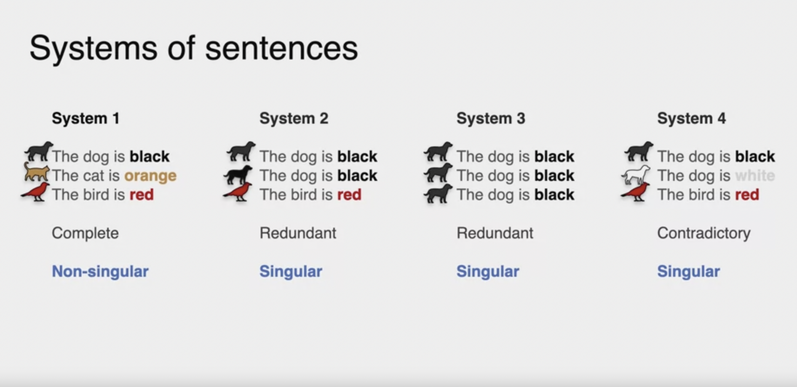
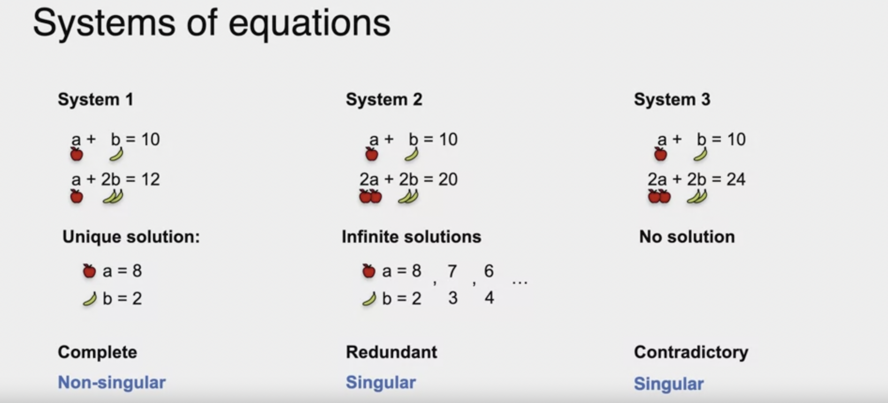
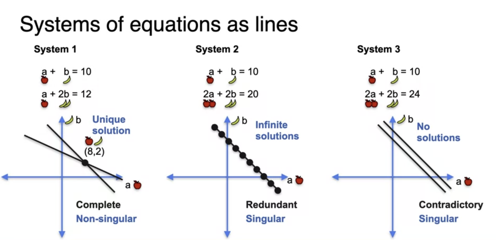
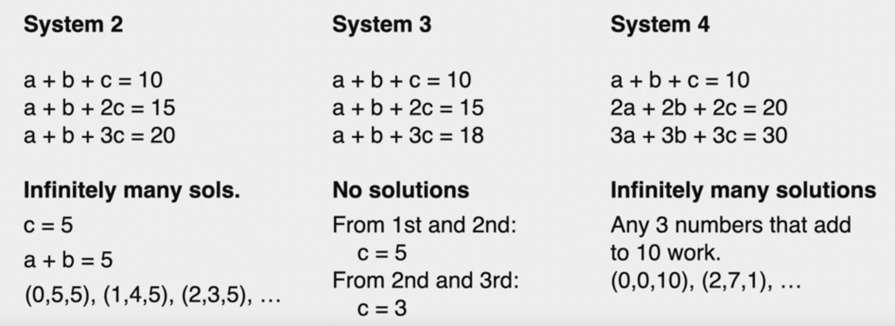
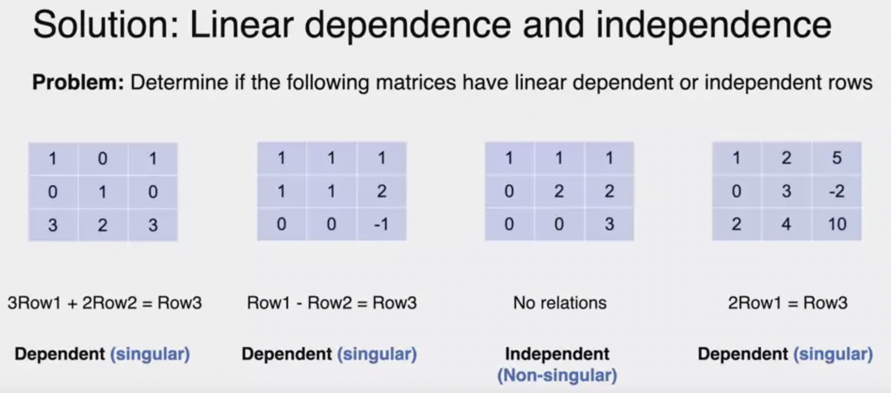
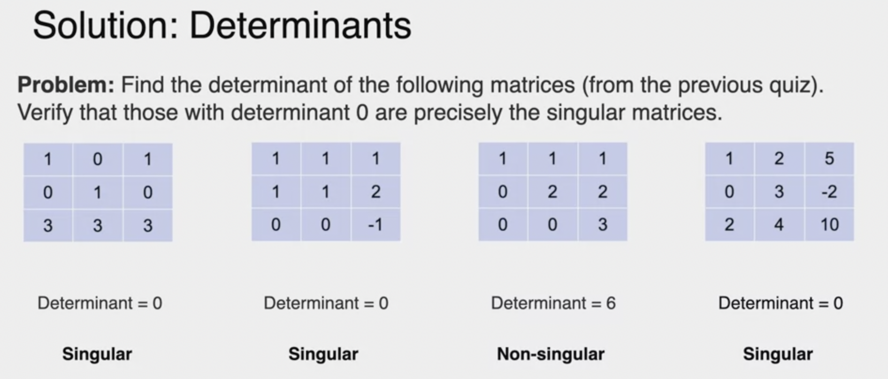

Matrices are commonly used in machine learning and data science to represent data and its transformations. 

How matrices naturally arise from systems of equations and how certain matrix properties can be thought in terms of operations on system of equations.

Learning Objectives

- Form and graphically interpret 2x2 and 3x3 systems of linear equations
- ```Determine the number of solutions``` to a 2x2 and 3x3 system of linear equations
- Distinguish between ``singular`` and ```non-singular``` systems of equations
- Determine the singularity of 2x2 and 3x3 system of equations by calculating the ```determinant```

A line == set of array 

## System of Sentences



A non singular system is a system that carries as many pieces of information as sentences. So it's the most informative system can be. 

A singular system is less informative than a non-singular one - redundant or contradictory or not enough information

## Sytem of Linear Equations

- Complete info : Unique Solution --> Non Singular
- Less info : Indefinte many solutions --> Singular
- Contradicotry : No solution --> Singular



## System of Linear Equations as Line



Constants in system of linear equations doesn't matter while evaluating for singularity or non-singularity.

```Linear Dependence``` 
- Singular equations are linearly dependent i.e. are 'x' times the original equations.
- Non singular are linearly independent equations.

```Determinant```
if 0 then Singular else Non-singular

## Linear Equation 3 variables 




- If the matrix is singular, the rows are dependent.

- If the matrix is non-singular, the rows are independent.



Finding Determinant 


